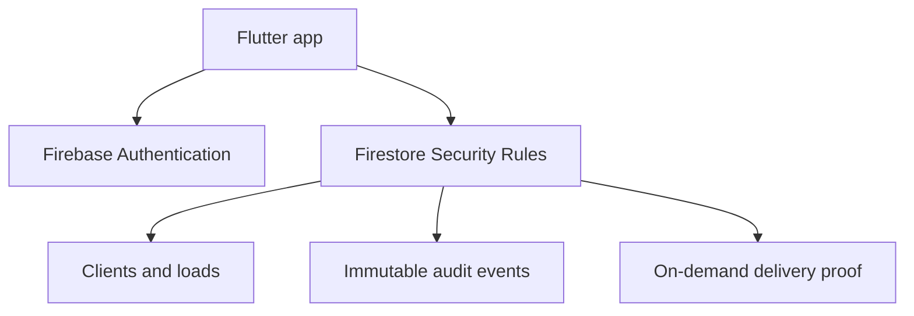

# Architecture walkthrough

The production path uses one backend: Firebase. The older FastAPI/SQLite code
is kept only as a record of the project's early stages.

## Why capabilities instead of one `role` string?

Small teams change responsibilities constantly. A dispatcher might need to
manage loads but not employee accounts; an owner might also drive. Independent
permission flags describe what someone can actually do without inventing a new
role for every combination.

## Why duplicate client and driver names on a load?

The IDs are the real relationships. The copied names preserve the historical
record if a client or employee later changes their display name. This is a
deliberate snapshot, not accidental denormalization.

## Why every load has `lastEventId`

Firestore rules cannot assume that a friendly app is the only client. Each
load mutation changes `lastEventId`, and the rules require a matching event in
the same atomic batch. A modified client therefore cannot change a status and
quietly skip the audit trail.

## Why proof is a subdocument

Signature PNGs are much larger than ordinary fields. Putting them directly on
the load would make every real-time list snapshot download the image again.
The `proofs/customerSignature` document is loaded only when a user taps “View
delivery proof.” Its large byte field is also excluded from Firestore indexes.

## Where business rules live

- The Flutter repository rejects obvious invalid actions and gives a readable
  explanation.
- Firestore rules repeat the important checks because client code can be
  modified or bypassed.
- Emulator tests prove the rules reject skipped statuses, unassigned drivers,
  missing audit events, oversized signatures, and proof replacement.

That repetition is intentional. Client validation improves usability;
server-side validation provides security.
